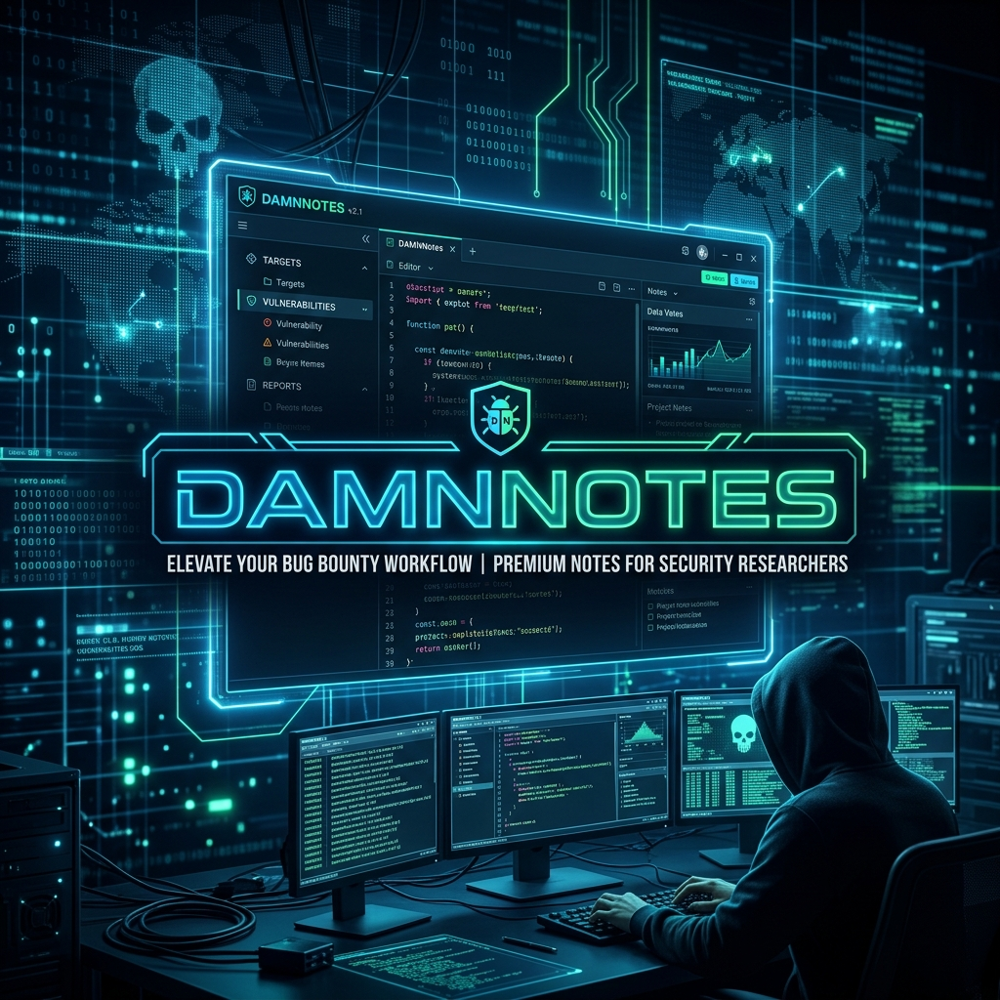

# 🛡️ DamnNotes



A locally hosted, zero-friction Markdown Note-Taking application and Web Terminal designed for high-performance Security Researchers and Bug Bounty Hunters. 

## 💎 Commercial Licensing
DamnNotes is a premium intelligence workspace for professional security researchers and Red Teams.

| Tier | Price | Features |
| :--- | :--- | :--- |
| **Individual License** | **$99** / Perpetual | 1 User, Lifetime Updates, Local Terminal |
| **Team License** | **$399** / Perpetual | 5 Users, Priority Support, Custom Branding |
| **Enterprise** | **$999** / Annual | Unlimited Seats, Air-Gapped Deployment, Compliance API |

To procure a license or request a demo for your security firm, please contact: `onlybugs05@example.com`

## 🛡️ Enterprise Security First
- **Zero-Knowledge Architecture**: No data ever leaves your machine. Perfect for secret infrastructure audits.
- **Air-Gapped Compatible**: Runs fully offline with no external dependencies required for the core UI or terminal.
- **Persistent Evidence Vault**: Securely manages findings, screenshots, and logs in a structured workspace.

## 🎹 Keyboard Shortcuts (Bounty Workflow)
- `Ctrl + S`: Instantly save the currently open file.
- `Alt + T`: Toggle the Web Terminal View seamlessly.
- `Alt + N`: Prompt to instantly create a new finding dossier.
- `Alt + D`: Create a new relative directory.
- `Alt + S`: Instantly trigger the fuzzy Intelligence Search.

## 🕹️ Quick Start (Licensed Users)
```bash
git clone https://github.com/onlybugs05/DamnNotes.git
cd DamnNotes
npm run build
npm link
```
Then run `damnnotes` in any active mission folder.

---
© 2026 onlybugs05. Proprietary Software. All rights reserved.

## ⚙️ Architecture 
- **Backend**: Express + express-ws (WebSocket Tunneling) + Bash `child_process`.
- **Frontend**: React + Vite + xterm.js + React-Markdown.

## 🤝 Contributing
Feel free to open PRs, build new tools, and submit bug reports!

Happy hunting. 🎯
